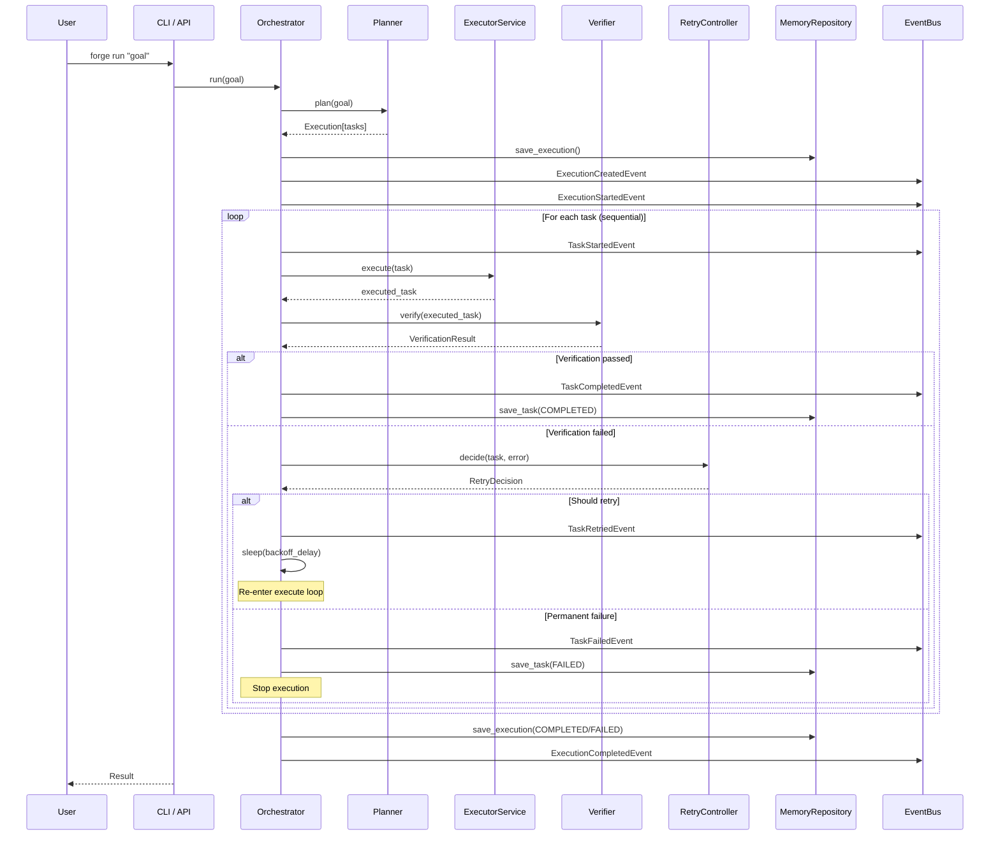
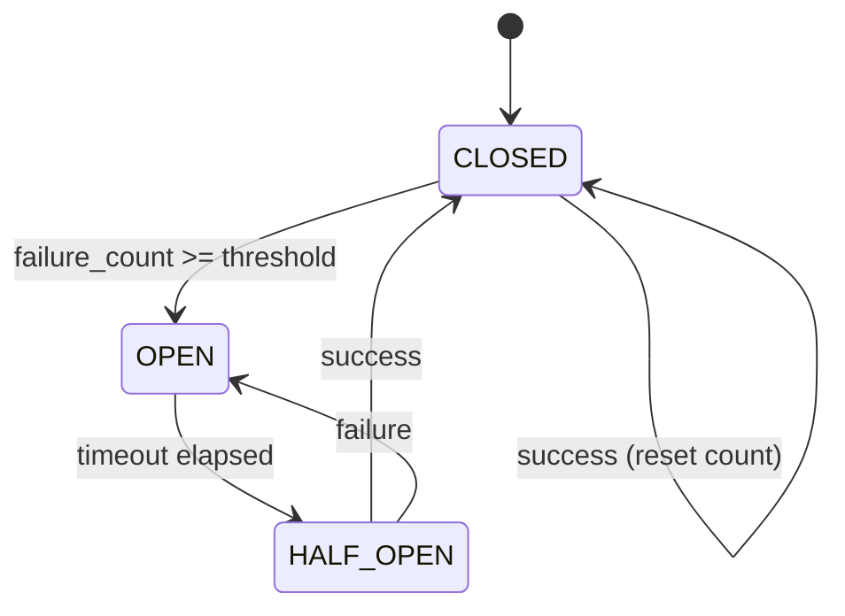
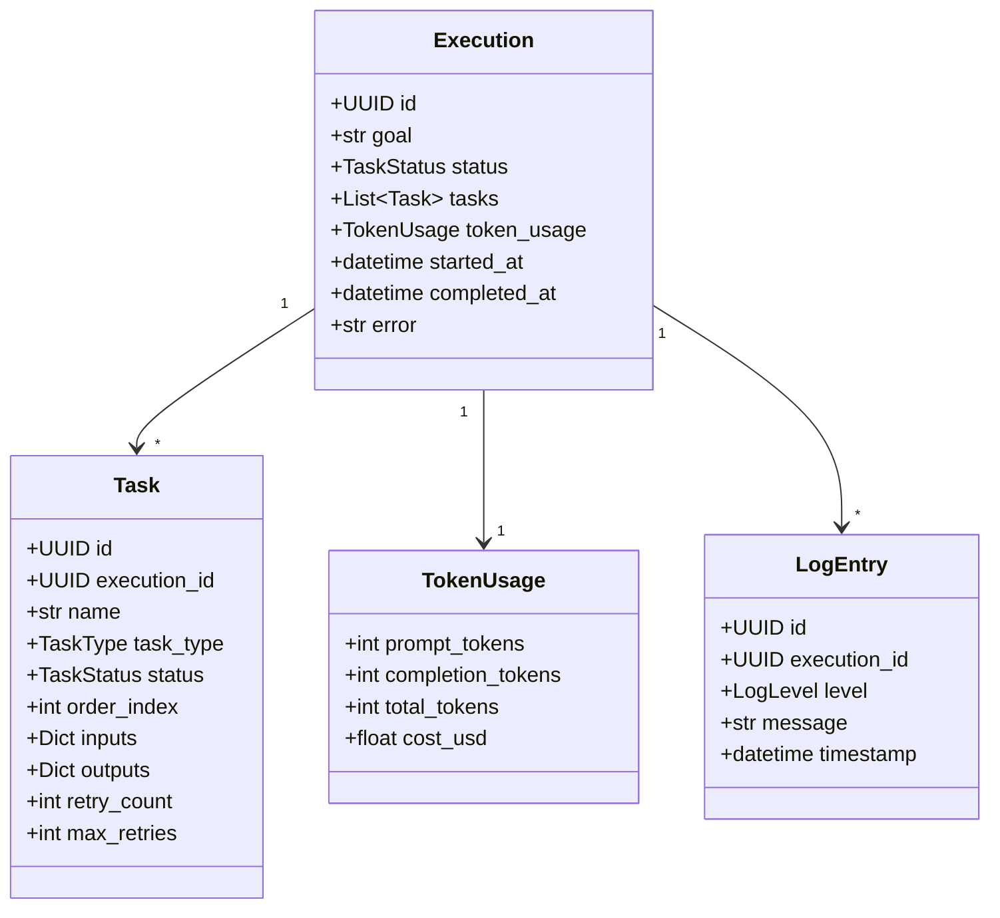

# Forge Architecture

## Overview

Forge is the AI Execution Layer — a runtime that sits between AI models and external tools,
guaranteeing goal completion through structured orchestration.

## Layer Structure

Forge follows Clean Architecture / Hexagonal Architecture principles:

```
┌─────────────────────────────────────────────────────────────┐
│                    Presentation Layer                        │
│              (FastAPI REST · WebSocket · CLI)                │
├─────────────────────────────────────────────────────────────┤
│                    Application Layer                         │
│    Orchestrator · Planner · Executors · Verifier · Retry    │
│    Context Optimizer · Memory Service · Plugin Manager       │
├─────────────────────────────────────────────────────────────┤
│                      Domain Layer                            │
│   Models · Interfaces · Events · Exceptions · Config        │
├─────────────────────────────────────────────────────────────┤
│                  Infrastructure Layer                        │
│     SQLite Repo · LLM Adapters · MCP Client · Event Bus     │
└─────────────────────────────────────────────────────────────┘
```

## Execution Flow (Mermaid Sequence)



## Circuit Breaker State Machine



## Domain Model



## Component Responsibilities

| Component | Layer | Responsibility |
|---|---|---|
| `Orchestrator` | Application | Coordinates full execution lifecycle |
| `RulePlanner` | Application | Deterministic goal decomposition |
| `LLMPlanner` | Application | LLM-powered goal decomposition |
| `FallbackPlanner` | Application | Tries LLM, falls back to Rule |
| `CLIExecutor` | Application | Shell command execution |
| `PythonExecutor` | Application | Python code execution |
| `GitExecutor` | Application | Safe git operations |
| `DockerExecutor` | Application | Docker operations |
| `MCPExecutor` | Application | MCP protocol execution |
| `ModelExecutor` | Application | Direct LLM calls |
| `CompositeVerifier` | Application | Chains multiple verifiers |
| `CircuitBreakerRetryController` | Application | Smart retry with circuit breaker |
| `RollingContextOptimizer` | Application | Token-aware context compression |
| `MemoryService` | Application | High-level memory facade |
| `PluginManager` | Application | Plugin discovery and loading |
| `SQLiteMemoryRepository` | Infrastructure | SQLite-backed persistence |
| `LocalEventBus` | Infrastructure | In-process pub/sub |
| `OllamaAdapter` | Infrastructure | Ollama LLM provider |
| `OpenAIAdapter` | Infrastructure | OpenAI LLM provider |
| `AnthropicAdapter` | Infrastructure | Anthropic LLM provider |
| `GeminiAdapter` | Infrastructure | Google Gemini LLM provider |
| `MCPClient` | Infrastructure | MCP protocol client |

## Extension Points

### Adding a New Executor

1. Implement `IExecutor` from `forge.core.domain.interfaces`
2. Add a new `TaskType` enum value if needed
3. Register in `Container.__init__` executors list
4. Or create a Plugin that implements `IPlugin` (which extends `IExecutor`)

```python
from forge.core.domain.interfaces import IExecutor
from forge.core.domain.models import Task, TaskType, TaskStatus

class MyCustomExecutor(IExecutor):
    def supports(self, task_type: TaskType) -> bool:
        return task_type == TaskType.CLI  # or a new custom type

    async def execute(self, task: Task) -> Task:
        # Your execution logic here
        task.status = TaskStatus.COMPLETED
        task.outputs = {"result": "done"}
        return task
```

### Adding a New LLM Provider

1. Implement `BaseLLMProvider` from `forge.infrastructure.llm.base`
2. Add the provider option to `ForgeSettings.llm_provider` Literal type
3. Add a case in `forge.infrastructure.llm.factory.create_llm_provider`

```python
from forge.infrastructure.llm.base import BaseLLMProvider, LLMResponse

class MyLLMProvider(BaseLLMProvider):
    async def complete(self, prompt: str, **kwargs) -> LLMResponse:
        # Call your LLM API here
        return LLMResponse(content="...", prompt_tokens=10, completion_tokens=20)

    async def is_available(self) -> bool:
        return True
```

### Adding a New Planner

1. Implement `IPlanner` from `forge.core.domain.interfaces`
2. Update `Container.__init__` to use the new planner

## Event-Driven Architecture

All inter-component communication goes through the `IEventBus`. This enables:
- Loose coupling between components
- Future distributed execution (swap `LocalEventBus` for a Redis/RabbitMQ adapter)
- Testability (subscribe test handlers in tests)
- Real-time UI updates via WebSocket bridge

### Event Types

| Event | Published By | Subscribed By |
|---|---|---|
| `ExecutionCreatedEvent` | Orchestrator | MemoryRepository, EventLog |
| `ExecutionStartedEvent` | Orchestrator | WebSocket Bridge |
| `ExecutionCompletedEvent` | Orchestrator | WebSocket Bridge, LearningInterface |
| `TaskStartedEvent` | Orchestrator | WebSocket Bridge |
| `TaskCompletedEvent` | Orchestrator | WebSocket Bridge, MemoryRepository |
| `TaskFailedEvent` | Orchestrator | RetryController, WebSocket Bridge |
| `TaskRetriedEvent` | Orchestrator | WebSocket Bridge |

## Directory Structure

```
packages/backend/src/forge/
├── core/
│   ├── domain/
│   │   ├── models.py          # Execution, Task, LogEntry, TokenUsage
│   │   ├── interfaces.py      # IExecutor, IPlanner, IVerifier, IPlugin, ...
│   │   ├── events.py          # All event dataclasses
│   │   └── exceptions.py      # ForgeError hierarchy
│   └── application/
│       ├── orchestrator.py    # Main Orchestrator
│       ├── planners/          # RulePlanner, LLMPlanner, FallbackPlanner
│       ├── executors/         # One file per executor type
│       ├── verifiers/         # CompositeVerifier + individual verifiers
│       ├── retry/             # CircuitBreakerRetryController
│       ├── context/           # RollingContextOptimizer
│       ├── memory/            # MemoryService
│       └── plugins/           # PluginManager
├── infrastructure/
│   ├── persistence/           # SQLiteMemoryRepository
│   ├── llm/                   # Adapters + factory
│   ├── mcp/                   # MCPClient
│   └── events/                # LocalEventBus
└── presentation/
    ├── api/                   # FastAPI routers, WebSocket
    └── cli/                   # Typer CLI commands
```

## Future Architecture (v2.0)

For parallel DAG execution and distributed workers, the architecture will extend to:

- `ParallelOrchestrator` — dispatches independent tasks concurrently using `asyncio.gather`
- `RedisEventBus` — for cross-process event distribution (drop-in replacement for `LocalEventBus`)
- `WorkerPool` — distributed task execution via Redis job queues
- `PostgreSQLRepository` — for high-throughput production deployments

These are architecture hooks in v1.0 — not yet implemented. The interfaces are designed to make this swap trivial.
